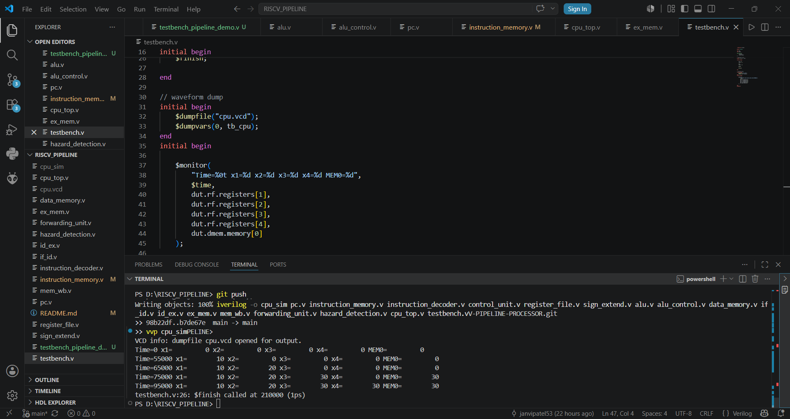
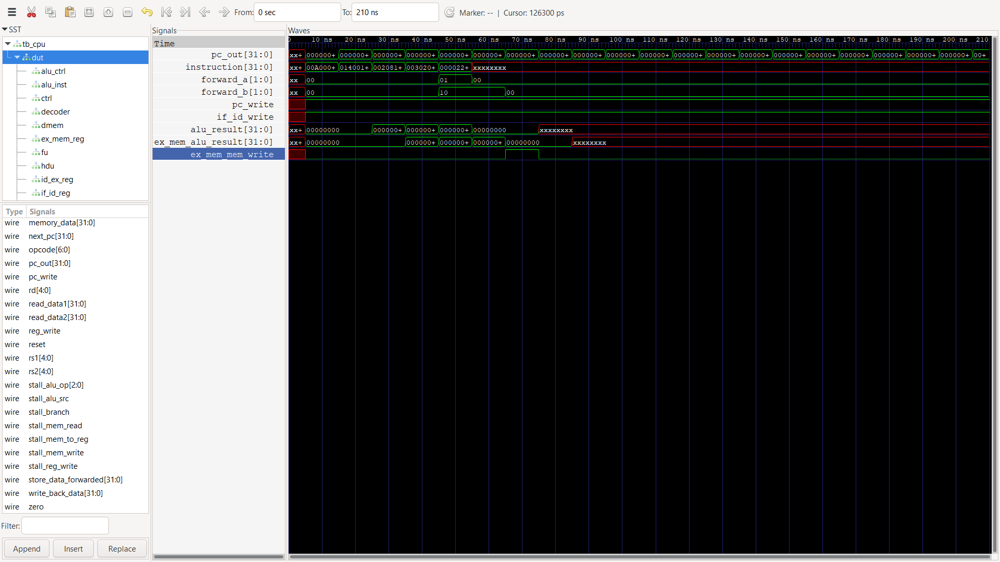

# 32-bit 5-Stage Pipelined RISC-V Processor

## About the Project

This project implements a 32-bit RISC-V processor using a 5-stage pipelined architecture in Verilog HDL.

The main objective of the project was to understand how pipelining improves processor performance and how hazards are handled in a pipelined CPU. Along with the basic pipeline stages, forwarding and hazard detection units were implemented to ensure correct instruction execution.

The design was simulated and verified using Icarus Verilog.

---

## Pipeline Stages

The processor is divided into the following stages:

1. Instruction Fetch (IF)
2. Instruction Decode (ID)
3. Execute (EX)
4. Memory Access (MEM)
5. Write Back (WB)

Pipeline registers used:

* IF/ID
* ID/EX
* EX/MEM
* MEM/WB

---
## Architecture

The processor consists of:

Instruction Memory → IF/ID → Decode → ID/EX → Execute → EX/MEM → Memory → MEM/WB → Write Back

Supporting modules:
- Forwarding Unit
- Hazard Detection Unit
- Control Unit
---
## Verification

The processor was verified using:
- Arithmetic instruction tests
- Forwarding tests
- Load-use hazard tests
- Memory access tests
---

## Features Implemented

* Program Counter (PC)
* Instruction Memory
* Register File
* ALU and ALU Control
* Immediate Generator
* Data Memory
* Control Unit
* 5-Stage Pipeline
* Forwarding Unit
* Hazard Detection Unit
* Pipeline Stall Handling
* Store Data Forwarding

---

## Instructions Supported

| Instruction | Function              |
| ----------- | --------------------- |
| ADD         | Register addition     |
| ADDI        | Immediate addition    |
| LW          | Load word from memory |
| SW          | Store word to memory  |
| BEQ         | Branch if equal       |

---

## Hazard Handling

### Forwarding

Forwarding paths are implemented to reduce unnecessary stalls caused by data dependencies between consecutive instructions.

### Hazard Detection

A hazard detection unit is used to detect load-use hazards. When required, the pipeline is stalled and a bubble is inserted to maintain correct execution.

---

## Example Test Program

```assembly
ADDI x1, x0, 10
ADDI x2, x0, 20
ADD  x3, x1, x2
SW   x3, 0(x0)
LW   x4, 0(x0)
```

Expected Output:

```text
x1 = 10
x2 = 20
x3 = 30
MEM[0] = 30
x4 = 30
```

The simulation results matched the expected output.

---

## Project Files

```text
pc.v
instruction_memory.v
instruction_decoder.v
control_unit.v
register_file.v
sign_extend.v
alu.v
alu_control.v
data_memory.v

if_id.v
id_ex.v
ex_mem.v
mem_wb.v

forwarding_unit.v
hazard_detection.v

cpu_top.v
testbench.v
```

---

## Tools Used

* Verilog HDL
* Icarus Verilog
* GTKWave
* Visual Studio Code
* GitHub

---

## Future Work

* Support for additional RISC-V instructions
* Branch prediction
* Cache memory implementation
* FPGA deployment

---
## Simulation Results

### Terminal Output



### Pipeline Waveform

